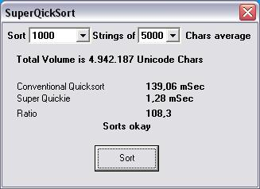



## A quicker Quicksort \(up to 100 times faster\)

### Description

Quicksort which works by sorting string pointers only instead of the strings themselves. In particular for long strings around 1000 chars there is a 15 times improvement in speed, going up to 100 times for really long strings, and speed is almost indepent of string length; one million strings are sorted in under five seconds. For short strings below 10 chars or so speeds are more or less identical. The screenshot shows the compiled timing.
 
### More Info
 

             |
---                |---
**Submitted On**   |2007-03-25 08:10:02
**By**             |[ULLI](https://github.com/Planet-Source-Code/PSCIndex/blob/master/ByAuthor/ulli.md)
**Level**          |Advanced
**User Rating**    |5.0 (45 globes from 9 users)
**Compatibility**  |VB 6\.0
**Category**       |[String Manipulation](https://github.com/Planet-Source-Code/PSCIndex/blob/master/ByCategory/string-manipulation__1-5.md)
**World**          |[Visual Basic](https://github.com/Planet-Source-Code/PSCIndex/blob/master/ByWorld/visual-basic.md)
**Archive File**   |[A\_quicker\_2055973252007\.zip](https://github.com/Planet-Source-Code/ulli-a-quicker-quicksort-up-to-100-times-faster__1-68111/archive/master.zip)

